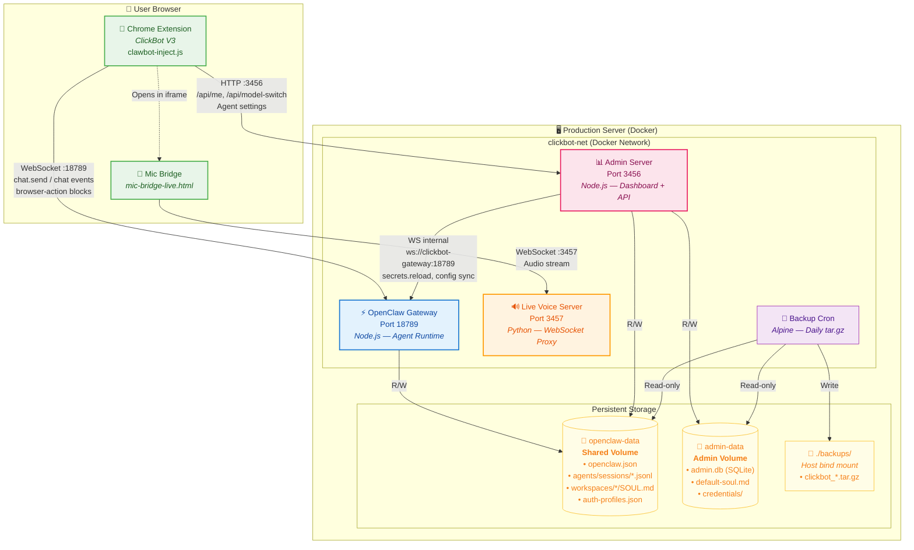
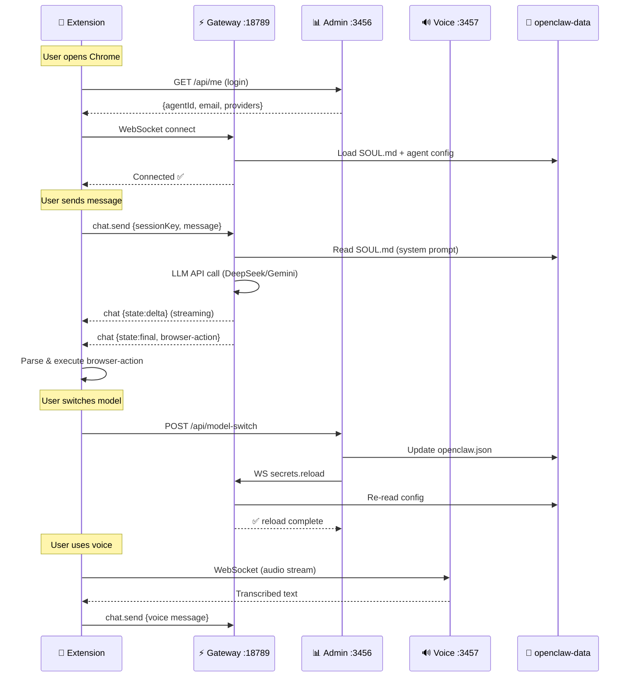

# ClickBot Production Architecture

## Full System Architecture

## Data Flow Details

## Port Map

| Port | Service | Protocol | Exposed To |
|------|---------|----------|------------|
| **18789** | Gateway | WebSocket | Extension (external) |
| **3456** | Admin | HTTP | Extension + Browser (external) |
| **3457** | Live Voice | HTTP + WS | Extension iframe (external) |

## Volume Map

| Volume | Containers | Access | Contents |
|--------|-----------|--------|----------|
| `openclaw-data` | Gateway + Admin + Backup | RW / RO | Agent data, sessions, SOUL.md, configs |
| `admin-data` | Admin + Backup | RW / RO | SQLite DB, credentials, templates |
| `./backups/` | Backup only | Write | Daily compressed backups |
